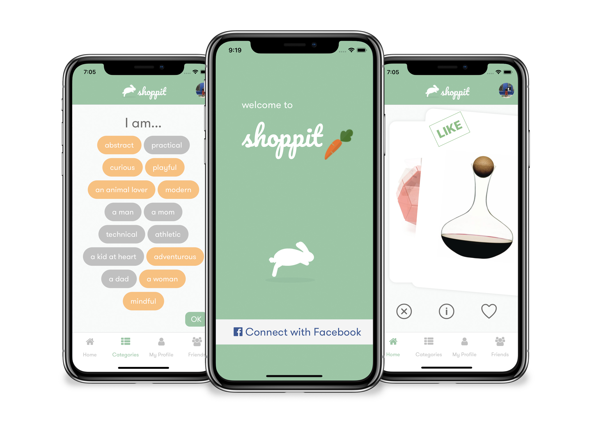
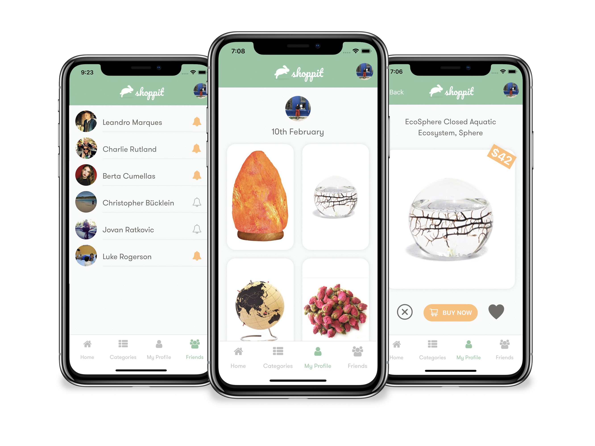

# Shoppit - Server

> Express server to compute and store data in a PostgreSQL database, providing services to our Shoppit mobile app.

<p align="center">
  
</p>

Shoppit is a social shopping app.

Spend a few minutes discovering your personalized, curated products. Buy something nice for yourself or a friend--never forget a birthday again!

## Table of contents

- [Screenshots](#screenshots)
- [Motivation](#motivation)
- [Getting started](#getting-started)
- [Usage](#usage)
- [Tech Stack](#tech-stack)
- [Developer team](#developer-team)

## Screenshots

<p align="center">
  
</p>

After connecting the app with Facebook, Shoppit will automatically detect a few categories you'll like and save them to your profile. If your recommendations feel a bit stale, you can customize your them at any time by saving whatever categories interest you. Tap on the home screen again to see your dynamically-updated item feed. Find something you like? Swipe right to save it on your profile!

<p align="center">
  
</p>

Connect to your friends without the hassle! Your friends list is automatically generated from your Facebook connections. Make sure you never forget a birthday again by tapping the bell icon next to a friend's name to subscribe to notifications. Need to get a friend something special? Simply browse their recently liked items on their profile. Just check out an item on their profile to find out more info, and once you find a match, buy it from Amazon directly within the app!

## Motivation

We wanted to make an app that would make shopping on your phone social and fun.

We have all forgotten a friend or family member's birthday in the past, so we wanted an easy way we could check and get notified of upcoming birthdays AND buy them something they actually wanted!

## Getting started

A few things you have to take in consideration before using Shoppit - Server

You'll need to install the Shoppit server first, and then set up the [Shoppit client](https://github.com/Luke-Rogerson/shoppit_client) to view the app in an emulator. More on that below.

After cloning the Shoppit - Server repo you'll have to :

### Install global and local dependancies:

- [Homebrew](https://brew.sh/)
- [Node](https://nodejs.org/en/): `brew install node`
- [Npm](https://www.npmjs.com/): `npm install`

### Migrate and connect Postgres database

Install PostgreSQL on your machine:

```bash
brew install postgres
```

Access PostgresSQL command line on the default database "postgres":

```bash
psql postgres
```

Your bash should now look like this:

```bash
psql (10.5)
Type "help" for help.

postgres=#
```

Now create a new database for the current user and connect it:

```bash
postgres=# CREATE DATABASE shoppit;
postgres=# \c shoppit;
```

The result will be:

```bash
You are now connected to database "shoppit" as user <user-name>.
shoppit=#
```

Now set a password for the current user:

```bash
shoppit=# ALTER USER <user_name> WITH PASSWORD 'new_password';
```

**Always remember the semicolon or the syntax will not work.**

Now your database setup is finished and you are ready to connect it with the server.

You can change the port or database name on postgres configuration database.

If you would like to use other SQL database you should just configure it in config/config.json.

Finally, migrate the database on your local machine:

```bash
cd shoppit_server
npm run recreateDb
```

## Usage

Start the server:

```bash
cd shoppit_server
npm start
```

To run the application, go to the [Shoppit client](https://github.com/Luke-Rogerson/shoppit_client) repo and follow the steps there to get the app up and running with the iOS simulator!

## Tech Stack

### Back-end

- [Express](https://expressjs.com/)
- [PostgreSQL](https://www.postgresql.org/)
- [Sequelize](http://docs.sequelizejs.com/)

### Front-end: [shoppit_client](https://github.com/Luke-Rogerson/shoppit_client)

## Developer team

- Amy Kirasack - [GitHub](https://github.com/momentmuse) - [LinkedIn](https://www.linkedin.com/in/amy-kirasack/)
- Charlie Rutland - [GitHub](https://github.com/charlierutland) - [LinkedIn](https://www.linkedin.com/in/charlie-rutland/)
- Luke Rogerson - [GitHub](https://github.com/Luke-Rogerson) - [LinkedIn](https://www.linkedin.com/in/lukerogerson/)
- Leandro Marques [GitHub](https://github.com/rusomarques) - [LinkedIn](https://www.linkedin.com/in/leandro-marques-pereira/)
